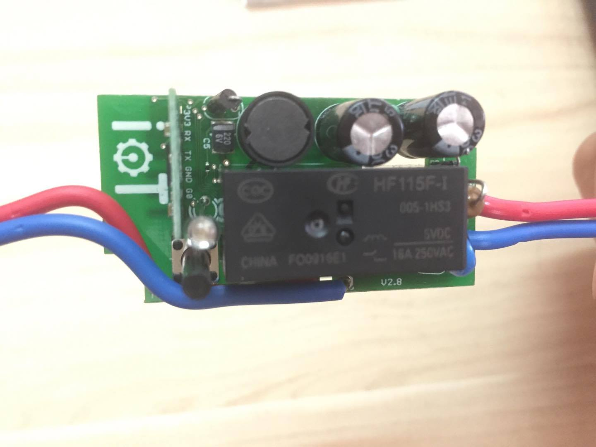
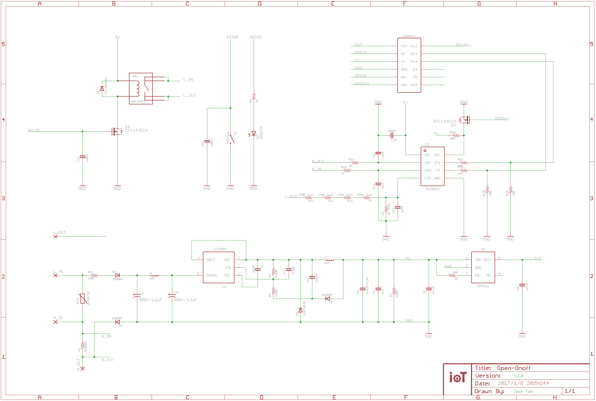
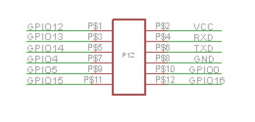
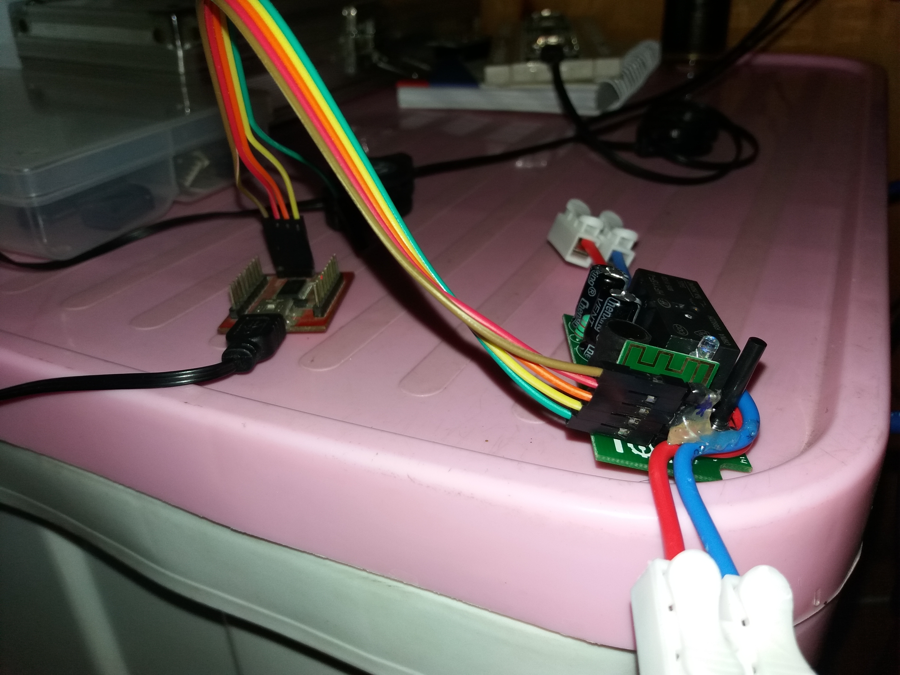
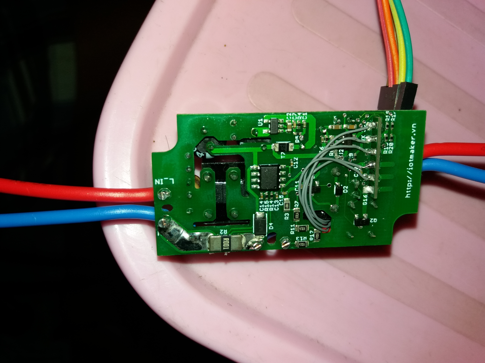
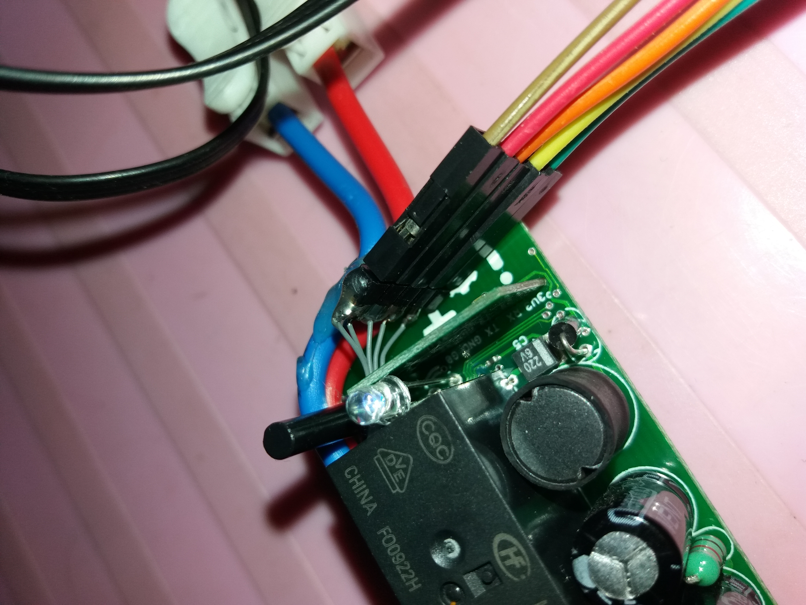

# Software

- Codes:
    + [Example code](./software/example-esp-pow/example-esp-pow.ino)  
    + [Node device code](./software/node-device/node-device.ino)

- To be able to build the example
```bash
# Install arduino IDE
https://arduino.esp8266.vn/basic/install.html
https://github.com/esp8266/Arduino#using-git-version


# Download all the dependencies libraries
git clone https://bitbucket.org/xoseperez/hlw8012.git
git clone git@github.com:blynkkk/blynk-library.git
git clone git@github.com:tzapu/WiFiManager.git

# and link it to arduino library
cd ~/bin/arduino-1.6.9/hardware/esp8266com/esp8266/libraries
ln -s <absolute-path-to-hlw8012> .
ln -s <absolute-path-to-blynk-library> .
ln -s <absolute-path-to-WiFiManager> .

# Now the example should be able to build with arduino IDE
```
- For more infomation visit:
    + Some more tips to debug with esp8266 arduino firmware: [tips](./software/tips.md)
    + Node device development guides and notes: [node-device-notes](./software/node-device/node-device-notes.md)

- External modules and libaries:
    + [HLW8012](https://bitbucket.org/xoseperez/hlw8012)  
    + [Wifi Manager](https://github.com/tzapu/WiFiManager)  

# Hardware

- Top view
  

- Board schematic
  

- Smart node pinout: [Smart node info](./hardware/smart-node.md)  
  

- Wiring ftdi - esp8285
  

- Soldering ftdi header
  

- Fix the header to board
  


# Distributor

[esp-pow](https://iotmaker.vn/esp-pow-thiet-bi-do-dien.html)  
[smart-node](https://iotmaker.vn/smartnode.html)

# Demo

[Link1](https://www.facebook.com/tuanpm.net/videos/1458801410810199/)
